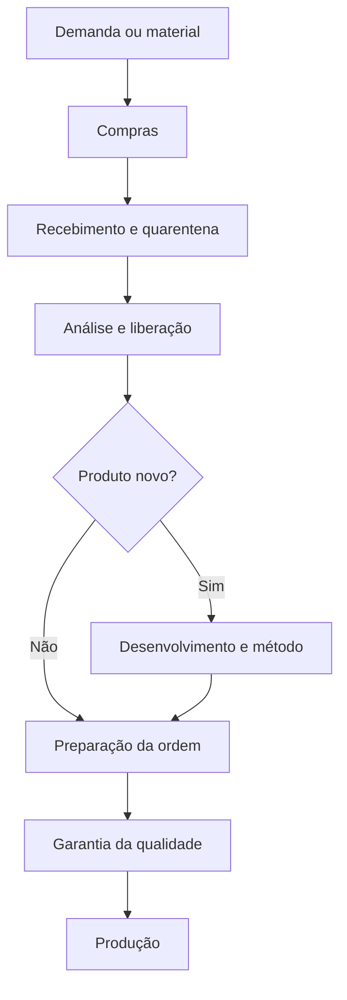

# Consolidação da Etapa 01 — Geolab

> [!info] Objetivo
> Consolidar os seis artefatos utilizados pela equipe, reconciliando-os com o [[mrd|MRD canônico]], a [[fontes/transcricao-luciano-almeida|transcrição de Luciano Almeida]] e o fato complementar de que o ERP é o **SAP**.

## 1. Síntese executiva

A etapa expandiu o desafio inicial de digitalização do backoffice para uma visão integrada de passagem de trabalho e informação entre compras, almoxarifado, áreas técnicas, qualidade e produção.

O conceito central proposto é:

> **Um processo, várias áreas e um histórico digital compartilhado, evitando espera, papel, aviso manual e redigitação.**

Os materiais também introduzem:

- um Business Model Canvas para a iniciativa interna;
- uma visão de sete áreas conectadas;
- implantação em ondas;
- estimativas de tempo e custo para dois contextos diferentes;
- uma narrativa simples para explicar a transformação;
- um cenário de desenvolvimento de medicamento genérico.

Esses conteúdos melhoram a visão do problema, mas ainda não comprovam qual processo deve ser o MVP nem quais ganhos são alcançáveis.

## 2. Fontes analisadas

| Fonte | Contribuição | Tratamento |
|---|---|---|
| [[fontes/etapa-01/01-business-model-canvas|Business Model Canvas]] | Modelo de valor interno, custos, atividades e stakeholders | Consolidado com correções de evidência |
| [[fontes/etapa-01/02-resumo-para-mrd|Resumo para MRD]] | Estrutura de requisitos e riscos | Já absorvido no MRD canônico |
| [[fontes/etapa-01/03-fluxo-integrado-deck|Fluxo integrado]] | Visão de sete áreas e implantação em ondas | Mantido como visão de futuro |
| [[fontes/etapa-01/04-ganhos-por-etapa|Ganhos por etapa]] | Baseline e reduções estimadas | Dados reportados a validar |
| [[fontes/etapa-01/05-desenvolvimento-de-generico|Desenvolvimento de genérico]] | Segundo fluxo, custos, prazos e contingências | Separado do ciclo operacional |
| [[fontes/etapa-01/06-linha-do-tempo-simples|Linha do tempo simples]] | Narrativa acessível das passagens de bastão | Mantida como material de comunicação |

## 3. Dois contextos que devem permanecer separados

### Contexto A — fluxo integrado descrito como produto já registrado

O material apresenta uma cadeia de sete etapas:

1. compras;
2. almoxarifado;
3. farmacotécnico;
4. desenvolvimento analítico;
5. controle de qualidade;
6. garantia da qualidade;
7. produção.

O artefato atribui ao ciclo:

- duração atual de **8 a 14 meses**;
- custo atual de **R$ 1,0 a 1,4 milhão**;
- redução estimada para **5,6 a 10 meses**;
- custo futuro estimado de **R$ 890 mil a R$ 1,247 milhão**.

> [!warning] Validação necessária
> Embora o material chame esse contexto de “produto já registrado”, ele inclui desenvolvimento farmacotécnico e analítico. É necessário confirmar se representa fabricação recorrente, alteração pós-registro, transferência, lançamento ou outro tipo de ciclo.

### Contexto B — desenvolvimento de genérico do zero

O material apresenta:

- ciclo total aproximado de **48 meses**;
- cerca de **24 meses internos**;
- cerca de **24 meses de análise na Anvisa**;
- custo total informado de aproximadamente **R$ 10 milhões**;
- meta proposta de submissão nos meses **19–20**, mantendo o mês 24 como limite interno.

Esses números pertencem a desenvolvimento de produto e não devem ser usados como baseline do processo operacional anterior.

## 4. Classificação das informações

### Fatos já sustentados

- A Geolab utiliza tecnologia moderna na produção.
- Alguns setores ainda utilizam bastante papel.
- Existe resistência interna à mudança.
- Aquisição, licenciamento e implantação afetam a decisão.
- A solução precisa gerar valor para clientes internos e diretoria.
- O ERP utilizado é o SAP.

### Informações reportadas nos artefatos, a validar

- ciclo de 8 a 14 meses e custo de R$ 1,0 a 1,4 milhão;
- ciclo de 48 meses e custo de R$ 10 milhões para um genérico;
- 24 meses de análise na Anvisa;
- sete áreas e papéis associados;
- existência de redigitação do mesmo dado quatro vezes;
- maior espera na garantia da qualidade;
- uso de planilhas, e-mail, cadernos e pastas físicas nas etapas descritas;
- disponibilidade de módulos ou licenças corporativas.

### Hipóteses ou propostas

- reduzir aproximadamente 30% do tempo do primeiro ciclo;
- evitar aproximadamente 11% do custo;
- antecipar a submissão do genérico em quatro ou cinco meses;
- reduzir o custo do genérico de R$ 10 milhões para R$ 9 milhões;
- usar a onda anterior para financiar a seguinte;
- Microsoft 365 estar contratado e subaproveitado;
- produção digitalizada funcionar como prova social;
- digitalização reduzir multas ou risco regulatório;
- adotar um único registro digital para toda a cadeia.

## 5. Verificação de consistência numérica

### Ganhos do fluxo integrado

Os cálculos apresentados são aritmeticamente coerentes como estimativas:

- tempo mínimo: 8,0 → 5,6 meses;
- tempo máximo: 14,0 → 10,0 meses;
- custo mínimo: R$ 1,000 → 0,890 milhão;
- custo máximo: R$ 1,400 → 1,247 milhão.

Isso equivale aproximadamente a:

- redução de 29% a 30% no tempo;
- redução próxima de 11% no custo.

A coerência matemática não comprova as premissas operacionais. Cada etapa precisa ser medida.

### Desenvolvimento de genérico

Foi identificada uma divergência interna:

- o resumo declara **R$ 9,2 milhões internos + R$ 0,8 milhão na Anvisa**;
- a tabela atribui **R$ 0,1 milhão à Anvisa** e, somando as demais fases, chega a aproximadamente **R$ 9,9 milhões**;
- a soma total da tabela continua próxima de R$ 10 milhões.

Essa distribuição deve ser corrigida com a fonte responsável antes de qualquer apresentação financeira.

## 6. Processo conceitual consolidado

> [!note] Modelo conceitual
> O fluxo real, sua ordem, paralelismos, retornos e registros no SAP precisam ser mapeados com os donos dos processos.

## 7. Necessidades consolidadas

A etapa reforça as seguintes necessidades:

- registrar uma informação uma única vez;
- encaminhar automaticamente o trabalho à próxima área;
- eliminar avisos manuais e procura por documentos;
- tornar status e pendências visíveis;
- controlar versões e aprovações;
- preservar histórico e autoria;
- integrar-se ao SAP sem duplicar o sistema de registro;
- demonstrar tempo e custo antes e depois;
- permitir adoção por ondas;
- separar digitalização operacional de desenvolvimento regulatório.

## 8. Business Model Canvas corrigido

| Bloco | Consolidação |
|---|---|
| Proposta de valor | Reduzir papel, espera e redigitação com benefício mensurável e adoção progressiva |
| Segmentos internos confirmados | TI, clientes internos, áreas operacionais/backoffice e diretoria |
| Segmentos a confirmar | Compras, almoxarifado, P&D, CQ, GQ, regulatório, financeiro, fiscal e RH |
| Canais | Fluxo integrado ao ambiente corporativo; canais específicos dependem da solução |
| Relacionamento | Cocriação, treinamento, acompanhamento e champions |
| Atividades | Mapear, medir, priorizar, prototipar, integrar e acompanhar adoção |
| Recursos | SAP confirmado; pessoas, módulos, APIs e outras licenças ainda a inventariar |
| Parcerias | Equipe SAP, integradores e fornecedores são candidatos, não contratos confirmados |
| Custos | Licença, implantação, integração, treinamento, suporte e tempo das áreas |
| Retorno | Horas economizadas, redução de espera/retrabalho, custo evitado e antecipação de valor |

## 9. Candidatos de MVP

Nenhum candidato está validado ou selecionado.

| Candidato | Valor demonstrável | Complexidade/Risco | Pergunta decisiva |
|---|---|---|---|
| Requisição de compra até recebimento/quarentena | Aprovação, rastreabilidade, menos redigitação e integração SAP | Dependência de dados e fluxo real de compras | Onde o processo atual sai do SAP e vira papel? |
| Solicitação de análise até laudo/liberação | Redução de espera e visibilidade de status | Requisitos de qualidade, assinatura e dados laboratoriais | Qual etapa gera mais espera e retrabalho? |
| Revisão e liberação pela garantia da qualidade | Potencial impacto sobre lote parado | Alto risco regulatório e de escopo | Quais documentos e assinaturas são obrigatórios? |
| Orquestração do dossiê de genérico | Grande impacto estratégico e narrativa forte | Escopo longo, múltiplas áreas e dependências externas | Qual recorte cabe no hackathon sem prometer reduzir Anvisa? |

### Leitura crítica

Para o hackathon, o fluxo completo de sete áreas deve permanecer como **visão escalável**. O MVP precisa demonstrar uma única passagem de bastão com:

- entrada estruturada;
- validação;
- encaminhamento;
- aprovação;
- atualização ou contrato de integração com SAP;
- indicador de ganho.

## 10. Implantação em ondas — hipótese revisada

| Onda | Escopo candidato | Objetivo |
|---|---|---|
| 1 | Uma passagem de bastão de baixo risco | Provar adoção e mensuração |
| 2 | Áreas adjacentes do mesmo fluxo | Demonstrar continuidade e integração |
| 3 | Fluxos técnicos ou regulados | Expandir após validar segurança e conformidade |
| 4 | Visão ponta a ponta | Consolidar histórico integrado |

As ondas dos arquivos recebidos são uma proposta, não uma decisão arquitetural.

## 11. Riscos atualizados

- confundir fabricação recorrente com desenvolvimento de produto;
- apresentar estimativas como resultados medidos;
- prometer redução de prazo da Anvisa;
- tentar implementar sete áreas no hackathon;
- presumir licenças Microsoft 365 ou módulos SAP;
- assumir assinatura eletrônica válida sem requisitos;
- prometer redução de risco regulatório sem validação;
- reproduzir dados em uma nova plataforma;
- escolher um processo visualmente atraente, mas sem dono disponível.

## 12. Validações prioritárias

1. Confirmar o significado do ciclo de 8 a 14 meses.
2. Confirmar fonte e composição dos custos de R$ 1,0 a 1,4 milhão.
3. Corrigir a distribuição dos R$ 10 milhões do genérico.
4. Confirmar áreas, papéis e sequência do processo.
5. Localizar onde o fluxo sai do SAP e passa para papel, e-mail ou planilha.
6. Identificar versão, módulos, APIs e licenças SAP.
7. Confirmar requisitos de assinatura, auditoria e retenção.
8. Escolher uma passagem de bastão para o MVP.
9. Registrar critérios e prazo do hackathon.
10. Validar baseline com pelo menos um dono de processo.

## 13. Decisão do Orquestrador

**Decisão: ajustar antes de avançar ao PRD.**

Os artefatos aumentaram a clareza da visão e produziram candidatos de MVP, mas não validaram o processo prioritário. O MRD continua ativo e foi enriquecido; o gate permanece aberto.

## Relacionamentos

- [[mrd|MRD canônico]]
- [[desafios|Desafio Geolab]]
- [[fontes/transcricao-luciano-almeida|Transcrição]]
- [[../tasks/README|Backlog]]
