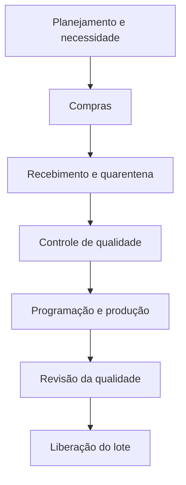

# Hipóteses de Ciclo

> [!warning] Classificação
> Este documento consolida a interpretação atual da equipe. Os dois cenários são **hipóteses de referência** e seus números ainda precisam ser confirmados pela Geolab.

## 1. Visão geral

Os materiais utilizados na etapa descrevem dois contextos de negócio diferentes:

| Dimensão | Hipótese A — Desenvolvimento de produto | Hipótese B — Produção de lote conhecido |
|---|---|---|
| Objetivo | Desenvolver e preparar um produto para submissão, registro e lançamento | Produzir e liberar um lote de um produto já conhecido |
| Horizonte | Longo prazo | Ciclo operacional mais curto |
| Custo | Alto investimento em desenvolvimento | Custo do ciclo de suprimento, análise, produção e liberação |
| Incerteza | Técnica, regulatória e científica | Operacional, qualidade, materiais e programação |
| Participantes | P&D, analítico, regulatório, qualidade, estudos externos e produção | Compras, almoxarifado, CQ, GQ, PCP e produção |
| Dependência externa | Anvisa, CRO e possíveis fornecedores especializados | Principalmente fornecedores e serviços operacionais |
| Resultado | Dossiê submetido, produto aprovado e transferido para rotina | Lote produzido, liberado e rastreável |
| Papel da digitalização | Integrar evidências, versões, decisões e dossiê | Reduzir espera, papel, redigitação e lote parado |

## 2. Hipótese A — Desenvolvimento de um produto

### Definição

Ciclo que começa na prospecção e viabilidade, passa por desenvolvimento farmacotécnico e analítico, lotes piloto, estabilidade, bioequivalência, preparação do dossiê, análise regulatória e transferência para produção.

### Referências numéricas recebidas

- aproximadamente **48 meses** no total;
- aproximadamente **24 meses de atividades internas**;
- aproximadamente **24 meses de análise na Anvisa**;
- aproximadamente **R$ 10 milhões** de custo total;
- submissão antecipada para os meses **19–20** como hipótese de melhoria.

> [!warning] Pendências
> Os números são reportados nos artefatos, não estão acompanhados de fonte primária e apresentam divergência na distribuição dos R$ 10 milhões.

### O que a digitalização pode afetar

- passagem de dados entre P&D, desenvolvimento analítico, qualidade e regulatório;
- controle de versões e evidências;
- montagem e prontidão do dossiê;
- identificação antecipada de pendências;
- resposta a exigências;
- transferência do conhecimento para produção.

### O que não deve ser prometido

- reduzir automaticamente o prazo de análise da Anvisa;
- eliminar duração científica obrigatória;
- garantir aprovação;
- reduzir estabilidade ou bioequivalência sem fundamento técnico;
- tratar estimativas como resultado medido.

## 3. Hipótese B — Produção de lote de produto conhecido

### Definição

Ciclo operacional para obter materiais, recebê-los e analisá-los, programar a produção, fabricar, revisar os registros e liberar um lote de produto cuja formulação e método já são conhecidos.

### Fluxo conceitual

### Referências numéricas recebidas

- ciclo de **8 a 14 meses**;
- custo de **R$ 1,0 a 1,4 milhão**;
- redução estimada para **5,6 a 10 meses**;
- custo futuro estimado de **R$ 890 mil a R$ 1,247 milhão**.

> [!warning] Pendências
> É necessário confirmar se esses números representam realmente um lote de rotina, um lote de lançamento, transferência, mudança pós-registro ou outra situação. Para fabricação recorrente, o intervalo pode estar agregando etapas anteriores à ordem de produção.

### O que a digitalização pode afetar

- requisições e aprovações;
- recebimento e identificação de materiais;
- solicitação e resultado de análise;
- visibilidade da quarentena;
- programação e ordem de produção;
- registro e revisão do lote;
- tratamento de desvios;
- assinatura e liberação;
- atualização do SAP e indicadores.

### O que não pertence automaticamente ao lote conhecido

- desenvolvimento da formulação;
- criação do método analítico;
- bioequivalência;
- montagem do dossiê inicial;
- análise inicial de registro pela Anvisa.

Essas atividades só entram quando houver alteração, transferência, investigação ou necessidade específica.

## 4. Elementos comuns

Os dois ciclos compartilham necessidades de plataforma e governança:

- identidade única para produto, material, documento, estudo ou lote;
- passagem digital de responsabilidade;
- controle de status e pendências;
- registro de autoria e data;
- integração com SAP;
- indicadores de tempo, espera e retrabalho;
- experiência simples para favorecer adoção;
- dados adequados para auditoria e decisão.

Isso permite apresentar uma **visão comum**, sem fingir que os processos são iguais.

## 5. Como usar no hackathon

### Narrativa estratégica

> A mesma lógica de orquestração digital pode apoiar dois horizontes: acelerar a preparação de um novo produto e tornar mais eficiente a produção de um lote conhecido.

### Regra de escopo

O MVP deve escolher apenas:

- um dos dois ciclos;
- uma passagem de bastão;
- um usuário solicitante;
- um responsável;
- uma aprovação ou decisão;
- uma interação ou contrato de integração com SAP;
- uma métrica demonstrável.

A outra hipótese pode aparecer como expansão futura.

## 6. Critérios para escolher

| Critério | Desenvolvimento de produto | Produção de lote conhecido |
|---|---|---|
| Impacto estratégico | Potencialmente muito alto | Alto e recorrente |
| Tempo para observar resultado real | Longo | Mais curto |
| Facilidade de demonstração | Média | Alta |
| Complexidade regulatória | Muito alta | Alta |
| Quantidade de áreas | Muito alta | Alta |
| Dependência externa | Alta | Menor |
| Adequação provável ao MVP | Recorte documental muito específico | Passagem operacional específica |

Nenhuma hipótese está selecionada.

## 7. Validações necessárias

1. Confirmar com a Geolab se essa interpretação dos dois ciclos está correta.
2. Definir início e fim de cada ciclo.
3. Confirmar quais áreas realmente participam.
4. Confirmar fontes e composição dos custos.
5. Confirmar quais tempos são de execução e quais são de espera.
6. Identificar registros já existentes no SAP.
7. Localizar a primeira passagem que sai do SAP para papel, e-mail ou planilha.
8. Escolher uma hipótese e um recorte para o MVP.

## Relacionamentos

- [[mrd|MRD canônico]]
- [[consolidacao-etapa-01|Consolidação da Etapa 01]]
- [[fontes/etapa-01/04-ganhos-por-etapa|Ganhos por etapa recebidos]]
- [[fontes/etapa-01/05-desenvolvimento-de-generico|Desenvolvimento de genérico recebido]]
- [[../tasks/README|Backlog]]
