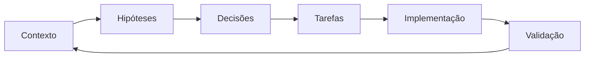

# SENAI IndTech

## Contexto principal

- [[desafios|Desafios industriais]]
- [[decisoes/README|Registro de decisões]]
- [[../tasks/README|Backlog e tarefas]]
- [[../prompts/README|Prompts reutilizáveis]]

## Estado atual

O repositório está na fase de **descoberta e estruturação do problema**. O primeiro desafio documentado é o da **Geolab Indústria Farmacêutica S/A**, relacionado à digitalização de processos de backoffice.

## Fluxo de trabalho agentic-first

## Próximas áreas a estruturar

- requisitos do desafio;
- personas e stakeholders;
- mapa de processos atuais;
- oportunidades de automação;
- arquitetura de solução;
- MVP;
- métricas de sucesso;
- riscos e conformidade.
