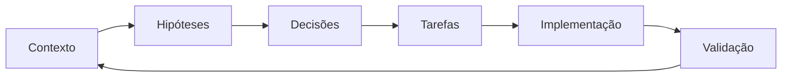

# SENAI IndTech

## Contexto principal

- [[desafios|Desafio Geolab]]
- [[fontes/transcricao-luciano-almeida|Fonte — depoimento de Luciano Almeida]]
- [[decisoes/README|Registro de decisões]]
- [[../tasks/README|Backlog e tarefas]]
- [[../prompts/README|Prompts reutilizáveis]]

## Estado atual

O repositório está na fase de **descoberta e estruturação do problema**. O desafio da Geolab é digitalizar processos de backoffice conciliando três resultados:

1. eficiência operacional;
2. adoção pelo cliente interno;
3. retorno sobre investimento atrativo para a diretoria.

A empresa já possui forte adoção tecnológica na produção. O recorte do MVP deve se concentrar em um processo de backoffice ainda não selecionado.

## Fluxo de trabalho agentic-first

## Próximas áreas a estruturar

- critérios e restrições do hackathon;
- MRD resumido;
- stakeholders e usuários;
- processos candidatos;
- baseline operacional e econômico;
- critérios de adoção;
- arquitetura somente após seleção do MVP;
- riscos, segurança e conformidade;
- narrativa e demonstração.
