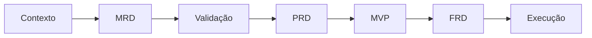

# SENAI IndTech

## Contexto principal

- [[desafios|Desafio Geolab]]
- [[mrd|MRD canônico]]
- [[fontes/transcricao-luciano-almeida|Fonte — depoimento de Luciano Almeida]]
- [[fontes/mrd-utilizado-original|Fonte — MRD recebido]]
- [[decisoes/README|Registro de decisões]]
- [[../tasks/README|Backlog e tarefas]]
- [[../prompts/README|Prompts reutilizáveis]]

## Estado atual

O repositório está na fase de **descoberta e validação do problema**. O MRD utilizado pela equipe foi confrontado com a transcrição e consolidado no [[mrd|MRD canônico]].

O desafio da Geolab é digitalizar processos de backoffice conciliando:

1. eficiência operacional;
2. adoção pelo cliente interno;
3. retorno sobre investimento atrativo para a diretoria;
4. uso coerente do SAP e das ferramentas existentes.

O MRD está ativo como referência, mas ainda não passou pelo gate de validação necessário para produzir o PRD. Falta selecionar um processo específico, mapear o fluxo atual e estabelecer baseline.

## Fluxo de trabalho agentic-first

## Próximas áreas a estruturar

- critérios e restrições do hackathon;
- processos candidatos;
- stakeholders e usuários do processo;
- baseline operacional e econômico;
- inventário do ambiente SAP;
- critérios de adoção;
- seleção e validação do MVP;
- riscos, segurança e conformidade;
- narrativa e demonstração.
